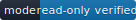
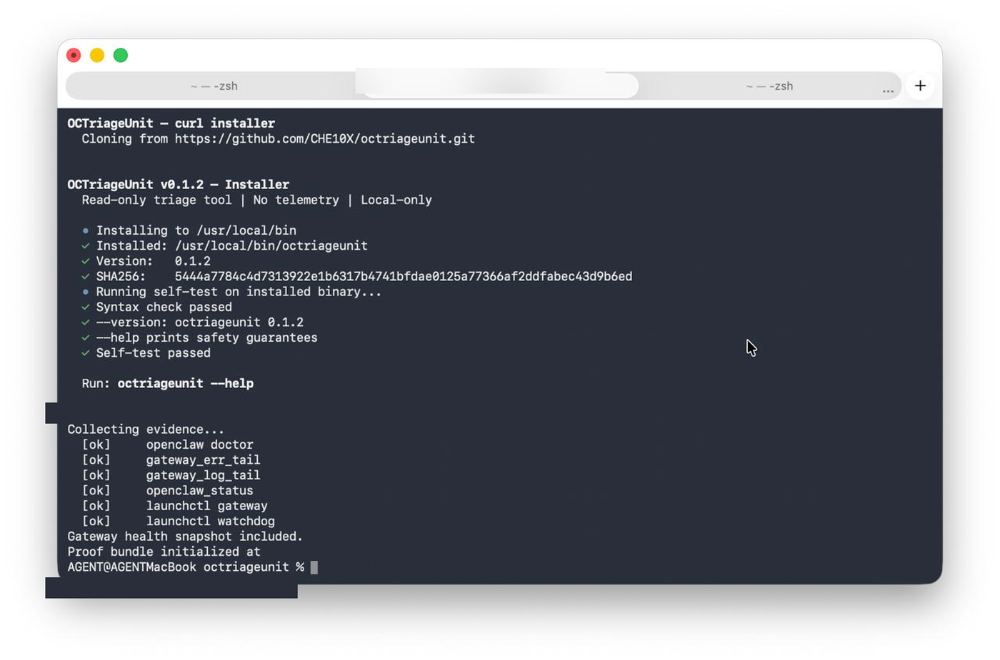
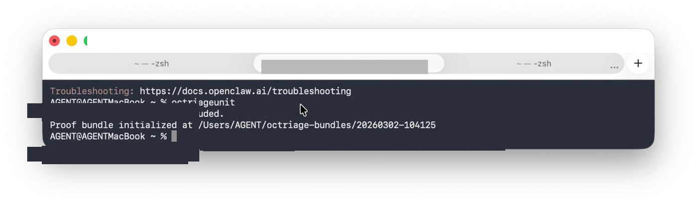

# OCTriageUnit

 

OCTriageUnit is a read-only control-plane triage tool for OpenClaw environments.

It gives you a fast, deterministic snapshot of gateway health, builder state, and core diagnostics — and packages the evidence into a timestamped proof bundle.

**Works even when your OpenClaw environment is already degraded.**

No telemetry. No mutation. No background services.

---

## Install + First Run

```bash
curl -fsSL https://raw.githubusercontent.com/CHE10X/octriageunit/main/install.sh | bash
```

Then run:

```bash
octriageunit --self-test && octriageunit
```



The bundle is written to `~/octriage-bundles/<timestamp>/` with real evidence files ready for review or support escalation.

---

## Health Verification

As of v0.1.5, OCTriageUnit evaluates health in this order:

- `gateway`: fast local liveness probe first, then healthcheck artifacts, then gateway error context
- `builder`: loaded `launchctl` job with a healthy schedule reports `SCHEDULED`; missing label reports `STOPPED`
- `verify`: compares the installed CLI SHA against an authoritative expected SHA when one is available

When the gateway is healthy, the local runtime normally presents three signals:



```
Runtime: running (pid <N>)
RPC probe: ok
Listening: 127.0.0.1:18789
```

If any are missing, run `octriageunit` immediately to capture a proof bundle before attempting any restart.

### Verify Behavior

The summary includes a verification line:

```text
verify: installed_sha=<sha> expected_sha=<sha> MATCH
```

Rules:

- `MATCH`: the installed CLI matches the recorded release checksum
- `MISMATCH`: the installed CLI differs from a known expected checksum; this degrades status
- `UNKNOWN`: no authoritative expected checksum was available, so OCTriageUnit reports the uncertainty without forcing a mismatch

The installer records the installed checksum alongside the binary as `octriageunit.sha256`, and the verifier prefers that record when present.

### Builder Classification

The digest builder is classified conservatively:

- `SCHEDULED`: launchd label is loaded and the scheduled job is healthy, even if it is idle between runs
- `DEGRADED`: label is loaded but last exit or recent builder errors indicate trouble
- `STALE`: label is loaded but digest freshness exceeds the expected interval
- `STOPPED`: launchd label is not loaded

---

## What Gets Collected

As of v0.1.5, all collection is real — no placeholder stubs.

| File | Source |
|------|--------|
| `bundle_summary.txt` | Version, timestamp, hostname |
| `doctor_output.txt` | `openclaw doctor` (25s timeout) |
| `gateway_err_tail.txt` | Filtered tail of `gateway.err.log` |
| `gateway_log_tail.txt` | Last 120 lines of `gateway.log` |
| `openclaw_status.txt` | `openclaw status` + `gateway status --deep` |
| `launchctl_gateway.txt` | `launchctl print` for gateway service |
| `launchctl_watchdog.txt` | `launchctl print` for watchdog service |
| `gateway_health.txt/json` | Copied from healthcheck agent output |
| `gateway_probe_meta.txt` | Local probe auth state used during gateway classification |
| `verify_integrity.txt` | Installed CLI SHA, expected SHA, and verify state |
| `manifest.sha256` | SHA-256 checksums of all artifacts |

---

## Safety Guarantees

**Read-only:** Never modifies configuration, restarts services, or changes system state.

**No telemetry:** Zero outbound network calls. No phone-home behavior.

**Local-only:** All execution on the operator machine.

**Proof bundle:** Writes only to `~/octriage-bundles/`.

**Auditable:** `cat bin/control-plane-triage` shows the full script.

---

## Installation Options

For a user-only install (no sudo):

```bash
curl -fsSL https://raw.githubusercontent.com/CHE10X/octriageunit/main/install.sh | bash -s -- --user
```

Verify install matches source:

```bash
bash scripts/install.sh --verify-from-source
```

Uninstall:

```bash
curl -fsSL https://raw.githubusercontent.com/CHE10X/octriageunit/main/scripts/uninstall.sh | bash
```

## Where Files Are Installed

| Item | Path |
|---|---|
| CLI binary | `/usr/local/bin/octriageunit` (system) or `~/.local/bin/octriageunit` (user) |
| App bundle | `~/Applications/OCTriageUnit.app` (optional, release zip only) |
| Proof bundles | `~/octriage-bundles/<timestamp>/` |

---

## How To Verify

```bash
shasum -a 256 bin/control-plane-triage
bash -n bin/control-plane-triage
```

Review full trust posture: [docs/trust-doctrine.md](docs/trust-doctrine.md)

Review bundle format: [docs/proof-bundle-format.md](docs/proof-bundle-format.md)

---

## Threat Model

OCTriageUnit reads local process and platform state through operator-invoked system tools, then writes artifacts into a local proof bundle. It cannot repair services, rotate credentials, or validate remote state. The trust boundary is the local host.

---

## Operator Notes

- Read-only by design — never touches anything outside `~/octriage-bundles/`
- Timed out commands are captured as evidence; the tool never stalls your recovery workflow
- Treat bundles as sensitive — redact before sharing externally

---

## License

MIT. See [LICENSE](LICENSE).
